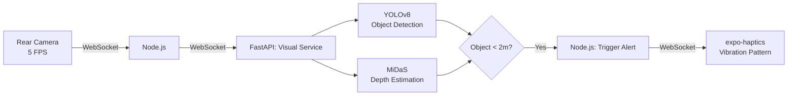
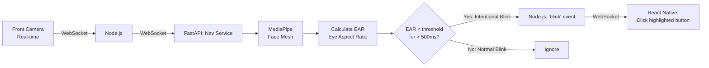
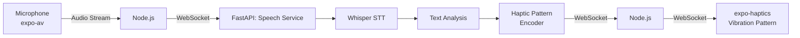
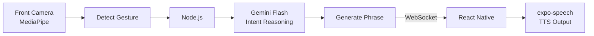

# 🔬 Unit Lens — Full Project Plan

> **An accessibility-first mobile app that translates sensory information across modalities — turning sight into touch, sound into vibration, and gesture into speech — empowering users with visual, auditory, or speech impairments.**

---

## 📋 Table of Contents

1. [Project Overview](#-project-overview)
2. [Team Structure](#-team-structure)
3. [Tech Stack](#-tech-stack)
4. [Architecture Overview](#-architecture-overview)
5. [Domain 1 — Visual & Spatial Mapping (The "Eyes")](#-domain-1--visual--spatial-mapping-the-eyes)
6. [Domain 2 — Zero-Touch Navigation (The "Hands")](#-domain-2--zero-touch-navigation-the-hands)
7. [Domain 3 — Speech & Hearing (The "Voice & Ears")](#-domain-3--speech--hearing-the-voice--ears)
8. [Integration Layer](#-integration-layer)
9. [Folder Structure](#-folder-structure)
10. [Development Phases & Timeline](#-development-phases--timeline)
11. [API Contracts](#-api-contracts)
12. [Deployment & DevOps](#-deployment--devops)
13. [Testing Strategy](#-testing-strategy)
14. [Risks & Mitigations](#-risks--mitigations)

---

## 🧭 Project Overview

| Field           | Detail                                                                 |
|-----------------|------------------------------------------------------------------------|
| **App Name**    | Unit Lens                                                              |
| **Platform**    | iOS & Android (via React Native / Expo)                                |
| **Purpose**     | Multi-sensory accessibility bridge for visually, hearing, and speech-impaired users |
| **Architecture**| Microservices split by sensory domain                                  |
| **Real-time**   | WebSocket-based (Socket.io + FastAPI WebSockets)                       |

---

## 👥 Team Structure

| Member      | Domain                        | Role Title                  |
|-------------|-------------------------------|-----------------------------|
| **Julia**   | Visual & Spatial Mapping      | Computer Vision Engineer    |
| **Thabelo** | Zero-Touch Navigation         | Interaction/UX Engineer     |
| **Oliviar** | Speech & Hearing              | Audio/NLP Engineer          |

Each member owns an independent Python microservice behind FastAPI, all orchestrated by a shared **Node.js** backend.

---

## 🛠 Tech Stack

### Frontend (Mobile)
| Technology          | Purpose                                 |
|---------------------|-----------------------------------------|
| React Native (Expo) | Cross-platform mobile framework         |
| `expo-camera`       | Rear + front camera access              |
| `expo-haptics`      | Vibration/tactile feedback              |
| `expo-av`           | Audio recording & playback              |
| `expo-speech`       | Text-to-Speech output                   |
| Socket.io Client    | Real-time WebSocket communication       |

### Backend (Orchestrator)
| Technology          | Purpose                                 |
|---------------------|-----------------------------------------|
| Node.js + Express   | Central API & WebSocket hub             |
| Socket.io           | Persistent bi-directional connections   |
| Redis               | Session/state caching, pub/sub          |
| MongoDB             | Persistent data (user profiles, prefs)  |

### AI Microservices (Python)
| Technology          | Purpose                                 |
|---------------------|-----------------------------------------|
| FastAPI             | High-performance async Python API       |
| FastAPI WebSockets  | Persistent streaming from Node.js       |
| YOLOv8 / YOLOv10   | Real-time object detection              |
| MiDaS (Intel)       | Monocular depth estimation              |
| MediaPipe Face Mesh | 468-point 3D facial landmark tracking   |
| OpenAI Whisper      | Speech-to-Text transcription            |
| Gemini 2.0 Flash    | Multimodal intent reasoning             |

---

## 🏗 Architecture Overview

```
┌──────────────────────────────────────────────────────────┐
│                   REACT NATIVE (Expo)                    │
│                                                          │
│  ┌────────────┐  ┌────────────┐  ┌─────────────────┐    │
│  │ Rear Camera│  │Front Camera│  │  Microphone/     │    │
│  │  (5 FPS)   │  │ (Blink)    │  │  Speaker         │    │
│  └─────┬──────┘  └─────┬──────┘  └───────┬─────────┘    │
│        │               │                 │               │
│        └───────┬───────┴────────┬────────┘               │
│                │   WebSocket    │                         │
│           ┌────▼────────────────▼────┐                    │
│           │      expo-haptics       │                    │
│           │      expo-speech        │                    │
│           └─────────────────────────┘                    │
└──────────────────────┬───────────────────────────────────┘
                       │ Socket.io (persistent)
              ┌────────▼────────┐
              │    NODE.JS      │
              │  Orchestrator   │
              │  (Express +     │
              │   Socket.io)    │
              └──┬─────┬─────┬──┘
                 │     │     │   FastAPI WebSockets
          ┌──────┘     │     └──────┐
          ▼            ▼            ▼
   ┌─────────────┐ ┌─────────┐ ┌──────────────┐
   │  🟢 VISUAL  │ │ 🔵 NAV  │ │  🟣 SPEECH   │
   │  Service    │ │ Service │ │  Service     │
   │  (Julia)    │ │(Thabelo)│ │  (Oliviar)   │
   │             │ │         │ │              │
   │ YOLOv8     │ │MediaPipe│ │ Whisper      │
   │ MiDaS      │ │Face Mesh│ │ Gemini Flash │
   └─────────────┘ └─────────┘ └──────────────┘
```

**Data Flow (continuous loop):**
```
React Native (Camera/Mic) ──WebSocket──▶ Node.js ──WebSocket──▶ Python (AI)
                                                                    │
React Native (Haptic/Audio) ◀──WebSocket── Node.js ◀──WebSocket────┘
```

---

## 👁️ Domain 1 — Visual & Spatial Mapping (The "Eyes")

**Owner:** Julia  
**Goal:** Translate the physical environment from the rear camera into spatial haptic feedback so the user can "feel" obstacles.

### Pipeline



### AI Models

| Model       | Task                | Why                                           |
|-------------|---------------------|-----------------------------------------------|
| **YOLOv8**  | Object detection    | Ultra-fast, lightweight, great for mobile edge cases |
| **MiDaS**   | Depth estimation    | Single-image depth — no stereo camera needed  |

### Datasets

| Dataset                | Use Case                       | Source                          |
|------------------------|--------------------------------|---------------------------------|
| **MS COCO**            | Object detection training/eval | [cocodataset.org](https://cocodataset.org) |
| **NYU Depth V2**       | Indoor depth estimation        | [NYU Depth V2](https://cs.nyu.edu/~silberman/datasets/nyu_depth_v2.html) |

### Haptic Mapping Logic

| Distance     | Vibration Pattern                        |
|--------------|------------------------------------------|
| 0 – 0.5 m   | 🔴 **Rapid heavy pulses** (danger!)      |
| 0.5 – 1.0 m | 🟠 **Fast medium pulses**                |
| 1.0 – 1.5 m | 🟡 **Moderate pulses**                   |
| 1.5 – 2.0 m | 🟢 **Slow light pulses** (aware)         |
| > 2.0 m      | ⚪ No vibration                           |

### Key Files to Create

```
services/visual/
├── main.py              # FastAPI app + WebSocket endpoint
├── detector.py          # YOLOv8 inference wrapper
├── depth_estimator.py   # MiDaS inference wrapper
├── haptic_mapper.py     # Distance → vibration pattern logic
├── models/              # Downloaded model weights
├── requirements.txt
└── Dockerfile
```

### Tasks Breakdown

- [ ] Set up FastAPI project with WebSocket endpoint
- [ ] Integrate YOLOv8 for object detection
- [ ] Integrate MiDaS for depth estimation
- [ ] Build the haptic mapping logic (distance → vibration intensity)
- [ ] Run both models concurrently on each frame (`asyncio.gather`)
- [ ] Benchmark FPS on target hardware (aim ≥ 5 FPS)
- [ ] Write unit tests for haptic mapper
- [ ] Dockerize the service

---

## 👁️‍🗨️ Domain 2 — Zero-Touch Navigation (The "Hands")

**Owner:** Thabelo  
**Goal:** Let the user navigate the entire app through intentional eye-blinks using the front-facing camera.

### Pipeline



### The Math — Eye Aspect Ratio (EAR)

```
        ‖p2 - p6‖ + ‖p3 - p5‖
EAR = ─────────────────────────
            2 × ‖p1 - p4‖

Where p1..p6 are the 6 landmarks around each eye.
```

| Condition              | EAR Value      | Action           |
|------------------------|----------------|------------------|
| Eyes wide open         | ~0.25 – 0.30   | No action        |
| Normal blink (< 200ms)| Drops briefly  | Ignored          |
| Intentional blink (≥ 500ms) | < 0.20 sustained | **Trigger click** |

### AI Models

| Model                  | Task                        | Note                              |
|------------------------|-----------------------------|-----------------------------------|
| **MediaPipe Face Mesh**| 468-point 3D face tracking  | Works out-of-the-box, no training |

### Datasets

| Dataset                         | Use Case                     | Source       |
|---------------------------------|------------------------------|--------------|
| **Closed Eyes in the Wild (CEW)** | Edge-case blink testing     | Kaggle       |

### Navigation UX Design

```
┌─────────────────────────────────┐
│         Unit Lens               │
│                                 │
│   ┌─────────────────────────┐   │
│   │  ▶ Spatial Mapping   ◀ │   │  ← Highlighted (active focus)
│   └─────────────────────────┘   │
│   ┌─────────────────────────┐   │
│   │    Voice Assistant      │   │
│   └─────────────────────────┘   │
│   ┌─────────────────────────┐   │
│   │    Settings             │   │
│   └─────────────────────────┘   │
│                                 │
│  BLINK to select │ DOUBLE to go │
│       back                      │
└─────────────────────────────────┘
```

- **Single intentional blink** → Select / Click
- **Double intentional blink** → Go back
- **Auto-scan mode** → Focus cycles through buttons every 2 seconds

### Key Files to Create

```
services/navigation/
├── main.py              # FastAPI app + WebSocket endpoint
├── face_tracker.py      # MediaPipe Face Mesh wrapper
├── blink_detector.py    # EAR calculation + intentional blink logic
├── requirements.txt
└── Dockerfile
```

### Tasks Breakdown

- [ ] Set up FastAPI project with WebSocket endpoint
- [ ] Integrate MediaPipe Face Mesh
- [ ] Implement EAR calculation from landmarks
- [ ] Build intentional blink detection (threshold + duration filter)
- [ ] Add double-blink detection for "go back"
- [ ] Build auto-scan focus cycling on the React Native side
- [ ] Test with CEW dataset edge cases
- [ ] Dockerize the service

---

## 🗣️ Domain 3 — Speech & Hearing (The "Voice & Ears")

**Owner:** Oliviar  
**Goal:** Convert incoming speech into tactile patterns (for deaf users) and translate micro-gestures into synthetic speech (for non-verbal users).

### Sub-Pipeline A: Hearing → Haptics



**Haptic Encoding Strategy:**

| Keyword / Phrase  | Vibration Pattern             | Description                  |
|-------------------|-------------------------------|------------------------------|
| "Hello"           | `· · · ─`                    | 3 short + 1 long             |
| "Danger" / "Stop" | `─ ─ ─ ─ ─`                  | 5 rapid long (urgent)        |
| "Yes"             | `· ─`                        | Short + long                 |
| "No"              | `─ ·`                        | Long + short                 |
| Question detected | `· · · · ?`                  | 4 short pulses (rising)      |
| Unknown word      | `· · ·`                      | 3 even pulses (fallback)     |

### Sub-Pipeline B: Gestures → Speech



**Gesture → Intent Mapping:**

| Micro-Gesture            | Raw Signal             | Gemini Intent Example                          |
|--------------------------|------------------------|-------------------------------------------------|
| Head tilt right          | `head_tilt_right`      | "Greet the person in front"                     |
| Head tilt left           | `head_tilt_left`       | "Say goodbye"                                   |
| Eyebrows raised (hold)  | `brows_raised_hold`    | "Ask a question about current context"          |
| Head nod                 | `head_nod`             | "Confirm / Say yes"                             |
| Head shake               | `head_shake`           | "Deny / Say no"                                 |
| Mouth open (sustained)  | `mouth_open_hold`      | "Call for help"                                 |

### AI Models

| Model              | Task                    | Note                                    |
|--------------------|-------------------------|-----------------------------------------|
| **OpenAI Whisper** | Speech-to-Text          | Handles accents, multilingual           |
| **Gemini 2.0 Flash**  | Intent reasoning     | Fast multimodal; understands context    |
| **MediaPipe**      | Gesture detection       | Shared with Thabelo's face mesh feed    |

### Datasets

| Dataset                  | Use Case                        | Source                                |
|--------------------------|---------------------------------|---------------------------------------|
| **Mozilla Common Voice** | Testing diverse voices/accents  | [commonvoice.mozilla.org](https://commonvoice.mozilla.org) |

### Key Files to Create

```
services/speech/
├── main.py              # FastAPI app + WebSocket endpoints
├── transcriber.py       # Whisper STT wrapper
├── haptic_encoder.py    # Text → haptic pattern encoder
├── gesture_detector.py  # MediaPipe gesture classification
├── intent_engine.py     # Gemini Flash intent reasoning
├── requirements.txt
└── Dockerfile
```

### Tasks Breakdown

- [ ] Set up FastAPI project with WebSocket endpoints (2 sub-pipelines)
- [ ] Integrate Whisper for real-time speech-to-text
- [ ] Build the haptic encoding dictionary
- [ ] Implement gesture detection from shared MediaPipe feed
- [ ] Integrate Gemini Flash for context-aware intent reasoning
- [ ] Connect to `expo-speech` TTS on the frontend
- [ ] Test with Mozilla Common Voice samples
- [ ] Dockerize the service

---

## 🔌 Integration Layer

### Why WebSockets (Not REST)

| Feature              | REST (axios)            | WebSockets (Socket.io)         |
|----------------------|-------------------------|--------------------------------|
| Latency              | High (new conn each)    | ✅ Low (persistent)            |
| Real-time streaming  | ❌ Polling required      | ✅ Native                      |
| Camera frame relay   | ❌ Too slow              | ✅ Designed for this           |
| Battery impact       | Higher (reconnections)  | Lower (single connection)      |

### Connection Topology

```
React Native ◄══ Socket.io ══► Node.js ◄══ FastAPI WS ══► Python Services
                                  │
                              ┌───┴───┐
                              │ Redis │  (pub/sub for cross-service events)
                              └───────┘
```

### Event Protocol

| Event Name             | Direction               | Payload                             |
|------------------------|-------------------------|--------------------------------------|
| `frame:rear`           | RN → Node → Visual      | `{ base64Frame, timestamp }`        |
| `frame:front`          | RN → Node → Nav+Speech  | `{ base64Frame, timestamp }`        |
| `audio:stream`         | RN → Node → Speech      | `{ audioChunk, sampleRate }`        |
| `obstacle:detected`    | Visual → Node → RN      | `{ object, distance, position }`    |
| `haptic:trigger`       | Node → RN               | `{ pattern, intensity, duration }`  |
| `blink:intentional`    | Nav → Node → RN         | `{ type: 'single'\|'double' }`      |
| `speech:transcribed`   | Speech → Node → RN      | `{ text, confidence, language }`    |
| `gesture:detected`     | Speech → Node            | `{ gesture, landmarks }`           |
| `intent:resolved`      | Speech → Node → RN      | `{ phrase, emotion, context }`      |
| `tts:speak`            | Node → RN               | `{ text, language, rate }`          |

---

## 📁 Folder Structure

```
Unit_Lens/
│
├── mobile/                          # React Native (Expo) App
│   ├── app/                         # App screens (Expo Router)
│   │   ├── index.tsx                # Home / dashboard
│   │   ├── spatial.tsx              # Spatial mapping screen
│   │   ├── voice.tsx                # Voice assistant screen
│   │   └── settings.tsx             # User preference screen
│   ├── components/
│   │   ├── BlinkNavigator.tsx       # Auto-scan + blink focus manager
│   │   ├── HapticFeedback.tsx       # Haptic pattern renderer
│   │   ├── CameraView.tsx          # Shared camera component
│   │   └── AccessibleButton.tsx     # High-contrast, large-tap target
│   ├── hooks/
│   │   ├── useSocket.ts            # WebSocket connection manager
│   │   ├── useHaptics.ts           # Haptic feedback abstractions
│   │   └── useCamera.ts            # Camera frame capture
│   ├── services/
│   │   └── socketEvents.ts         # Event name constants & types
│   ├── app.json
│   ├── package.json
│   └── tsconfig.json
│
├── backend/                         # Node.js Orchestrator
│   ├── src/
│   │   ├── server.ts               # Express + Socket.io setup
│   │   ├── routes/
│   │   │   ├── health.ts           # Health-check endpoint
│   │   │   └── config.ts           # User config CRUD
│   │   ├── sockets/
│   │   │   ├── frameRouter.ts      # Route camera frames to services
│   │   │   ├── audioRouter.ts      # Route audio to speech service
│   │   │   └── eventBridge.ts      # Python → RN event relay
│   │   ├── services/
│   │   │   ├── visualClient.ts     # WS client → Python visual
│   │   │   ├── navClient.ts        # WS client → Python nav
│   │   │   └── speechClient.ts     # WS client → Python speech
│   │   └── utils/
│   │       ├── logger.ts
│   │       └── config.ts
│   ├── package.json
│   └── tsconfig.json
│
├── services/                        # Python AI Microservices
│   ├── visual/                      # 👁️ Julia's domain
│   │   ├── main.py
│   │   ├── detector.py
│   │   ├── depth_estimator.py
│   │   ├── haptic_mapper.py
│   │   ├── models/
│   │   ├── requirements.txt
│   │   └── Dockerfile
│   │
│   ├── navigation/                  # 👁️‍🗨️ Thabelo's domain
│   │   ├── main.py
│   │   ├── face_tracker.py
│   │   ├── blink_detector.py
│   │   ├── requirements.txt
│   │   └── Dockerfile
│   │
│   └── speech/                      # 🗣️ Oliviar's domain
│       ├── main.py
│       ├── transcriber.py
│       ├── haptic_encoder.py
│       ├── gesture_detector.py
│       ├── intent_engine.py
│       ├── requirements.txt
│       └── Dockerfile
│
├── docker-compose.yml               # Orchestrates all services
├── .env.example                     # Environment variable template
├── PLAN.md                          # This file
└── README.md
```

---

## 📅 Development Phases & Timeline

### Phase 1 — Foundation (Week 1–2)

| Task                                        | Owner    | Status |
|---------------------------------------------|----------|--------|
| Initialize Expo project + navigation        | All      | ☐      |
| Set up Node.js + Socket.io server           | All      | ☐      |
| Set up FastAPI boilerplate × 3 services     | Each     | ☐      |
| Docker Compose for local dev                | All      | ☐      |
| WebSocket connection: RN ↔ Node ↔ Python    | All      | ☐      |
| Establish event protocol & shared types     | All      | ☐      |

### Phase 2 — Core AI Integration (Week 3–5)

| Task                                        | Owner    | Status |
|---------------------------------------------|----------|--------|
| YOLOv8 object detection pipeline            | Julia    | ☐      |
| MiDaS depth estimation pipeline             | Julia    | ☐      |
| Haptic distance mapping                     | Julia    | ☐      |
| MediaPipe Face Mesh integration             | Thabelo  | ☐      |
| EAR-based blink detection                   | Thabelo  | ☐      |
| Whisper STT integration                     | Oliviar  | ☐      |
| Gesture detection from MediaPipe            | Oliviar  | ☐      |
| Gemini Flash intent engine                  | Oliviar  | ☐      |

### Phase 3 — Frontend UX (Week 5–7)

| Task                                        | Owner    | Status |
|---------------------------------------------|----------|--------|
| Haptic feedback renderer component          | Julia    | ☐      |
| Blink-navigator with auto-scan              | Thabelo  | ☐      |
| High-contrast, large-tap accessible UI      | Thabelo  | ☐      |
| Voice assistant screen                      | Oliviar  | ☐      |
| TTS output via expo-speech                  | Oliviar  | ☐      |
| Settings: sensitivity, speed, language      | All      | ☐      |

### Phase 4 — Integration & Testing (Week 7–9)

| Task                                        | Owner    | Status |
|---------------------------------------------|----------|--------|
| End-to-end WebSocket pipeline test          | All      | ☐      |
| Latency benchmarking (target < 200ms)       | All      | ☐      |
| Edge-case testing (lighting, noise, etc.)   | All      | ☐      |
| Battery & performance profiling             | All      | ☐      |
| Accessibility audit (screen reader compat)  | All      | ☐      |

### Phase 5 — Polish & Demo (Week 9–10)

| Task                                        | Owner    | Status |
|---------------------------------------------|----------|--------|
| Bug fixes & UX refinements                  | All      | ☐      |
| Demo video / presentation prep              | All      | ☐      |
| Documentation (README, API docs)            | All      | ☐      |
| Final deployment / APK build                | All      | ☐      |

---

## 📡 API Contracts

### Node.js REST Endpoints

| Method | Endpoint            | Description                       |
|--------|---------------------|-----------------------------------|
| GET    | `/health`           | Health check for all services     |
| GET    | `/api/config/:uid`  | Get user preferences              |
| PUT    | `/api/config/:uid`  | Update user preferences           |
| POST   | `/api/calibrate`    | Run blink calibration sequence    |

### Python FastAPI Endpoints (per service)

| Service    | Endpoint            | Type      | Description                     |
|------------|---------------------|-----------|---------------------------------|
| Visual     | `/ws/frames`        | WebSocket | Receives rear camera frames     |
| Navigation | `/ws/face`          | WebSocket | Receives front camera frames    |
| Speech     | `/ws/audio`         | WebSocket | Receives audio stream           |
| Speech     | `/ws/gesture`       | WebSocket | Receives gesture landmarks      |
| All        | `/health`           | GET       | Service health check            |

---

## 🐳 Deployment & DevOps

### Docker Compose Services

```yaml
services:
  mobile:        # Expo dev server (dev only)
  backend:       # Node.js orchestrator
  visual:        # Python visual service
  navigation:    # Python navigation service
  speech:        # Python speech service
  redis:         # Pub/sub & caching
  mongo:         # User profiles & preferences
```

### Environment Variables

```env
# Node.js
NODE_ENV=development
SOCKET_PORT=3000
REDIS_URL=redis://redis:6379
MONGO_URI=mongodb://mongo:27017/unitlens

# Python Services
VISUAL_SERVICE_URL=ws://visual:8001/ws/frames
NAV_SERVICE_URL=ws://navigation:8002/ws/face
SPEECH_SERVICE_URL=ws://speech:8003/ws/audio

# AI Keys
GEMINI_API_KEY=your_gemini_api_key
```

---

## 🧪 Testing Strategy

| Layer          | Tool                    | What to Test                                |
|----------------|-------------------------|---------------------------------------------|
| Unit (Python)  | `pytest`                | Model inference, EAR calc, haptic mapping   |
| Unit (Node)    | `jest`                  | Event routing, socket handlers              |
| Unit (RN)      | `jest` + RTL            | Component rendering, hook behavior          |
| Integration    | `pytest` + `socket.io`  | End-to-end frame → haptic pipeline          |
| E2E (Mobile)   | Detox / Maestro         | Full user flows with simulated blink input  |
| Performance    | Custom benchmark script | FPS, latency, memory, battery drain         |

---

## ⚠️ Risks & Mitigations

| Risk                                        | Impact | Mitigation                                        |
|---------------------------------------------|--------|---------------------------------------------------|
| High latency on AI inference                | High   | Optimize models (TensorRT/ONNX), reduce frame rate |
| False blink detection                       | High   | Calibration step per user, adjustable threshold    |
| Battery drain from continuous camera        | Medium | Adaptive FPS, pause when idle                     |
| Whisper model too large for mobile          | Medium | Run on server only, stream audio via WebSocket     |
| Poor lighting affects vision/face detection | Medium | Infrared fallback, confidence thresholds           |
| Gesture conflicts with blinks              | Medium | Separate gesture vs. blink state machines          |
| Network dependency for AI processing        | High   | Offline fallback with TFLite models for basics     |

---

## 🎯 Success Metrics

| Metric                              | Target                |
|--------------------------------------|-----------------------|
| Obstacle detection latency           | < 200ms end-to-end   |
| Blink detection accuracy             | > 95% intentional     |
| False blink rate                     | < 2%                  |
| Speech-to-text accuracy              | > 90% (Whisper)       |
| Gesture recognition accuracy         | > 85%                 |
| Battery life (active use)            | > 2 hours continuous  |
| App crash rate                       | < 0.1%                |

---

> **Next Steps:** Review this plan, assign team members to Phase 1 tasks, and begin scaffolding the project structure.
